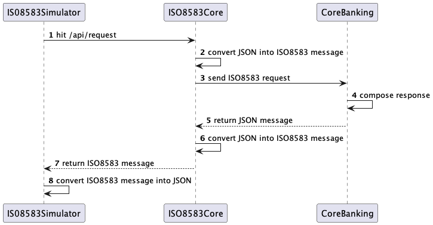

# ISO8583 Example


this project consist of 3 module, which are:
- core-banking: act as a issuer (core-banking system), accept a message using REST Api.
- iso8583-core: act as a converter, convert iso8583 message into REST Api, once receive response it convert back into ISO8583 message.
- iso8583-simulator: act as a acquirer, convert REST Api into iso8583, once receive response it convert back.


## Sequence Diagram



## Run Project
- start CoreBankingApplication.java
- start ISO8583CoreApplication.java
- start ISO8583SimulatorApplication.java

- send a transfer message
```shell
curl --location 'localhost:1200/api/request' \
--header 'Content-Type: application/json' \
--data '{
    "mti": "0200",
    "timeout": 10000,
    "message": "test simulator",
    "body": {
        "3": "123456",
        "11": "000001",
        "41": "00000001",
        "48": "Tutorial ISO 8583 Dengan Java",
        "70": "301"
    }
}'
```

- send a network message
```shell
curl --location 'localhost:1200/api/request' \
--header 'Content-Type: application/json' \
--data '{
    "mti": "0800",
    "timeout": 10000,
    "message": "test simulator",
    "body": {
        "3": "123456",
        "11": "000001",
        "41": "00000001",
        "48": "Tutorial ISO 8583 Dengan Java",
        "70": "301"
    }
}'
```

- send unknown message
```shell
curl --location 'localhost:1200/api/request' \
--header 'Content-Type: application/json' \
--data '{
    "mti": "0100",
    "timeout": 10000,
    "message": "test simulator",
    "body": {
        "3": "123456",
        "11": "000001",
        "41": "00000001",
        "48": "Tutorial ISO 8583 Dengan Java",
        "70": "301"
    }
}'
```

## Add New Handler
- Create new spring bean that implements `IService`
- add mapping participant under `resources/deploy/005_transaction_manager.xml` on iso8583-core module
- `name` is message MTI, `value` is spring bean name